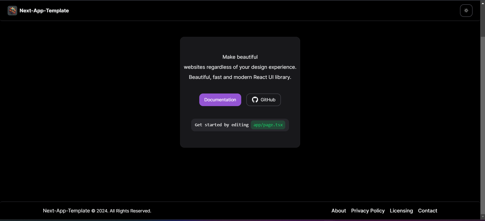
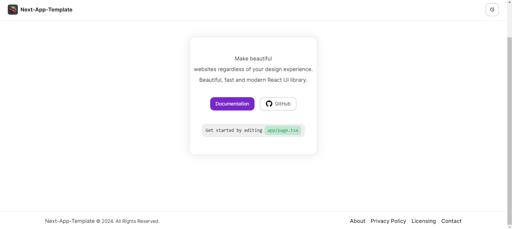

# Next.js & NextUI Template

This is a template for creating applications using Next.js 14 (app directory) and NextUI (v2).

## Preview

- The preview of this template is available at https://next-app-nextui-template.vercel.app/





## Technologies Used

- [Next.js 13](https://nextjs.org/docs/getting-started)
- [NextUI v2](https://nextui.org/)
- [React Icons](https://react-icons.github.io/react-icons/)
- [Tailwind CSS](https://tailwindcss.com/)
- [Tailwind Variants](https://tailwind-variants.org)
- [TypeScript](https://www.typescriptlang.org/)
- [Framer Motion](https://www.framer.com/motion/)
- [next-themes](https://github.com/pacocoursey/next-themes)

## How to Use

### Use the template with create-next-app

To create a new project based on this template using `create-next-app`, run the following command:

```bash
npx create-next-app -e https://github.com/Navin-Jethwani-76/next-app-template
```

### Run the development server

```bash
npm run dev
```

## License

Licensed under the [MIT license](https://github.com/Navin-Jethwani-76/next-app-template/blob/main/LICENSE).
